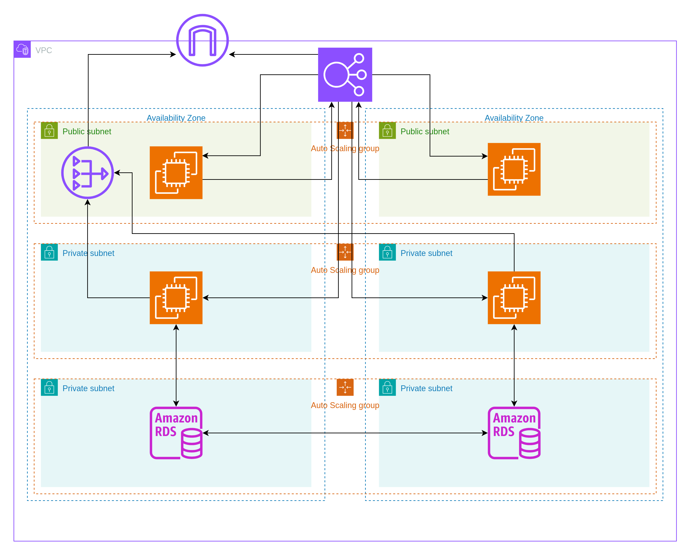

# aws-terraform-projects

Repo showcasing multiple DevOps projects depoyed to AWS via Terraform and CI/CD pipelines through GitHub Actions.

# Project List

This repository contains multiple folders, each of which is a standalone deployment project with its own Terraform config and workflow file.

| Folder                                                                    | Description                                                                                                                                                                                  |
| ------------------------------------------------------------------------- | -------------------------------------------------------------------------------------------------------------------------------------------------------------------------------------------- |
| [1. Three Tier Infrastructure React Springboot RDS App](3-tier-infra-app) | Complete AWS three-tier infrastructure using Terraform, Packer, and GitHub Actions — deploying a **React frontend**, **Spring Boot backend**, and **MySQL database** via CI/CD.              |
| [2. Cloud-Native EKS MSK RDS App](eks-msk-rds-app)                        | Production-ready three-tier application on AWS using **EKS**, **MSK (Kafka)**, and **RDS** — featuring modular Terraform architecture, dual CI/CD workflows, event-driven microservices, and comprehensive operational excellence. |
| [3. AMI Creation EC2 AMI EC2](ec2-ami-ec2)                                | AWS AMI creation and deployment demonstration using **Terraform** — showcasing custom **AMI creation** from EC2 instances and **infrastructure replication** workflows.                      |
| [4. VPC Networking Fundamentals Subnet EC2 RDS](subnet-ec2-rds)           | AWS VPC networking fundamentals with **EC2** and **RDS (PostgreSQL)** — demonstrating **subnet design**, **security groups**, and **database connectivity** patterns.                        |
| [5. S3 Static Website with CloudFront](s3-website)                        | Simple, cost-effective static website hosting using **S3** and **CloudFront** — featuring automatic content deployment, secure access controls, and CI/CD workflows.                         |

---

# Project Descriptions

## [1. Three Tier Infrastructure React Springboot RDS App](3-tier-infra-app/README.md)

### **Three-Tier Infrastructure App (Terraform + Packer + GitHub Actions)**

#### **Summary:**

This project automates the deployment of a full **three-tier web application** on AWS using **Terraform**, **Packer**, and **GitHub Actions**.

It provisions a **React-based frontend**, a **Java Spring Boot backend**, and a **MySQL (RDS)** database — all deployed through CI/CD pipelines.

**Description:**

- The infrastructure follows a secure, isolated VPC design with public, private, and database subnets.
- It builds custom EC2 AMIs for both the React frontend and the Spring Boot backend using Packer, and deploys them via Auto Scaling Groups behind an Application Load Balancer.
- A GitHub Actions workflow manages the full lifecycle — provisioning, AMI builds, application deployment, and teardown — providing a fully automated, reproducible infrastructure-as-code solution.

---

## [2. EKS MSK RDS App](eks-msk-rds-app/README.md)

### **Cloud-Native Three-Tier Architecture (EKS + MSK + RDS + GitHub Actions)**

#### **Summary:**

This project demonstrates a **production-ready, event-driven three-tier application** deployed on AWS using **Amazon EKS**, **Amazon MSK (Managed Kafka)**, and **Amazon RDS**. 

It showcases modern cloud-native architecture patterns with **real-time event streaming**, **modular Terraform infrastructure**, **automated CI/CD pipelines**, and **comprehensive operational excellence**.

### **Application Code:**

The application frontend and backend are created in ThymeLeaf and Springboot.

**Application Source**: [Thymeleaf Springboot Kafka App](https://github.com/manvinderjit/react-springboot-kafka-apps)

### **Project Summary:**

**Description:**

- **Modular Terraform Architecture**: Four specialized modules (VPC, EKS, MSK, RDS) with proper dependency management and resource tagging
- **EKS Cluster**: Kubernetes 1.33 with 2-node cluster, AL2023 AMI, essential addons (VPC CNI, CoreDNS, Kube Proxy), and IAM access entries
- **Multi-Tier Networking**: 8 subnets across 2 AZs (public, private EKS, private MSK, database) with NAT gateway and security group isolation
- **Event Streaming**: MSK Kafka 3.8.x cluster (2 brokers) for real-time message processing between ThymeLeaf frontend and Spring Boot backend
- **Database**: MySQL 8.0.42 RDS (db.t4g.micro) in isolated database subnets with no public access
- **Application**: Containerized Java ThymeLeaf frontend and Spring Boot backend with health checks, resource limits, and high availability (2 replicas each)
- **Load Balancing**: Classic ELB with cross-zone load balancing, health checks, and external access
- **CI/CD Pipelines**: Dual GitHub Actions workflows - automated deployment on push and manual destruction with safety confirmations
- **Security**: OIDC authentication, least privilege IAM, network isolation, encrypted secrets, and comprehensive access controls

**Key Features**: 
- **Infrastructure Excellence**: Modular Terraform, multi-AZ deployment, cost-optimized instances, security-first design
- **Operational Excellence**: GitOps workflows, configuration management, state management, resource monitoring
- **Application Architecture**: Event-driven microservices, container orchestration, health monitoring, topology awareness
- **Security & Compliance**: Network security, identity management, secrets management, encryption, access control

---

## [3. EC2 AMI EC2](ec2-ami-ec2/README.md)

### **Custom AMI Creation and Deployment (EC2 + AMI Management)**

#### **Summary:**

This project demonstrates **AWS AMI (Amazon Machine Image) creation and replication** using Terraform. It showcases the fundamental process of creating custom AMIs from running EC2 instances and using those AMIs to deploy identical infrastructure.

**Description:**

- **EC2 Deployment**: Initial t2.micro instance with custom configuration and user data script
- **AMI Creation**: Automated custom AMI generation from the configured EC2 instance using Terraform
- **Instance Replication**: New EC2 instances deployed from the custom AMI, ensuring identical configuration
- **IAM Integration**: EC2 instances configured with S3 read-only access via IAM roles and instance profiles
- **Security Configuration**: Security groups allowing HTTP (80) and SSH (22) access with proper network controls
- **Infrastructure as Code**: Complete Terraform automation for AMI lifecycle management

**Key Features**: Golden AMI creation, infrastructure standardization, rapid deployment workflows, and configuration consistency across instances.

**Use Cases**: Perfect for learning AMI management, server standardization, disaster recovery scenarios, and understanding fundamental AWS compute patterns.

---

## [4. Subnet EC2 RDS](subnet-ec2-rds/README.md)

### **VPC Networking Fundamentals (VPC + EC2 + RDS)**

#### **Summary:**

This project demonstrates **AWS VPC networking fundamentals** with EC2 and RDS integration using Terraform. It showcases essential networking concepts including subnets, route tables, security groups, and secure database connectivity patterns.

**Description:**

- **Custom VPC**: Isolated network environment (10.0.0.0/16) with DNS support and hostname resolution
- **Multi-Subnet Design**: Public subnet for web server and private subnets for database across multiple availability zones
- **EC2 Web Server**: t2.micro instance in public subnet running Apache HTTP server with custom content
- **PostgreSQL RDS**: Database instance in private subnets with no public internet access for security
- **Security Groups**: Network-level controls allowing HTTP access to web server and database access only from EC2
- **Route Tables**: Proper traffic routing with internet gateway for public subnet and local-only routing for private subnets

**Key Features**: VPC fundamentals, subnet isolation, security group best practices, multi-AZ database design, and secure EC2-RDS connectivity.

**Learning Objectives**: Perfect for understanding AWS networking basics, security group configurations, database isolation patterns, and infrastructure-as-code networking implementations.

---

## [5. S3 Static Website with CloudFront](s3-website/README.md)

### **Static Website Hosting (S3 + CloudFront + GitHub Actions)**

#### **Summary:**

This project demonstrates **simple, cost-effective static website hosting** on AWS using **S3** and **CloudFront**. It features automatic content deployment, secure access controls, and complete CI/CD workflows for both deployment and destruction.

**Description:**

- **S3 Bucket**: Private bucket with automatic file upload and proper MIME type detection for HTML, CSS, JS, and image files
- **CloudFront CDN**: Global content delivery with default SSL certificate, Origin Access Control (OAC), and optimized caching
- **Automatic Deployment**: Terraform uploads website content directly from local files with change detection via ETags
- **Security**: Private S3 bucket secured via CloudFront OAC, HTTPS by default, no public bucket access
- **CI/CD Workflows**: GitHub Actions for automated deployment on push and manual infrastructure destruction with safety confirmations
- **Cost Optimization**: Uses cheapest CloudFront price class, no versioning, and minimal logging for development use

**Key Features**: Automatic content deployment, secure access patterns, default HTTPS, GitHub Actions integration, and comprehensive safety controls for infrastructure management.

**Use Cases**: Perfect for portfolios, documentation sites, marketing pages, and learning AWS static hosting fundamentals with modern DevOps practices.

---
