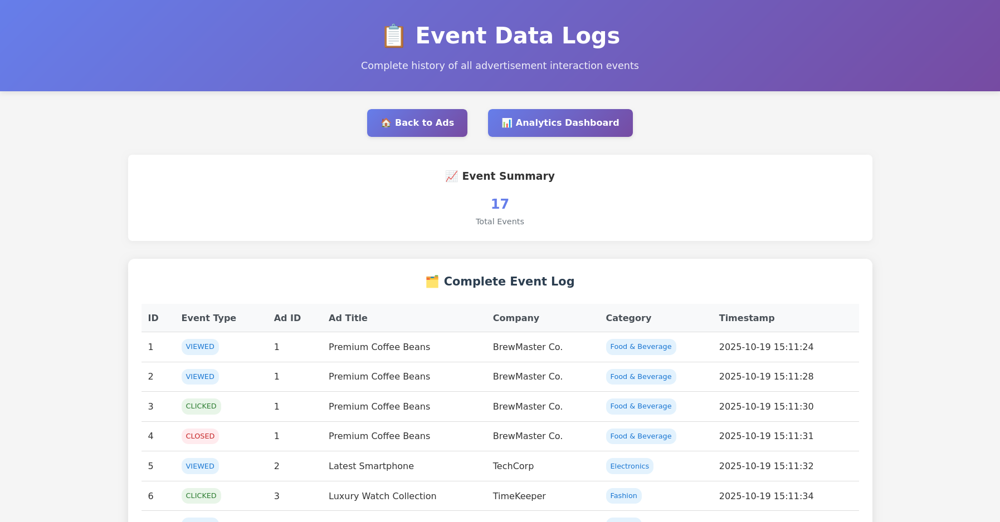

# 🚀 EKS MSK RDS App - Kubernetes Three-Tier Application

This project demonstrates a complete **three-tier Kubernetes application** deployed on AWS using **EKS**, **MSK (Kafka)**, and **RDS**. It showcases modern cloud-native architecture with event-driven communication and managed AWS services.

**Application Source Code**: [react-springboot-kafka-apps](https://github.com/manvinderjit/react-springboot-kafka-apps)

---

## 📦 Architecture Overview


The stack includes:

- **Frontend (React)** - Event-driven UI for real-time data visualization
- **Backend (Spring Boot)** - REST API with Kafka producer/consumer integration  
- **Database (MySQL RDS)** - Persistent storage for application data
- **Message Queue (MSK)** - Event streaming between frontend and backend
- **Container Orchestration (EKS)** - Managed Kubernetes cluster

### Application Features:
- **Real-time Events**: Frontend publishes events via Kafka
- **Event Processing**: Backend consumes and processes Kafka messages
- **Data Persistence**: Events stored in MySQL database
- **Live Updates**: Real-time UI updates through event streaming

### Network Architecture:
- **Public Subnets**: EKS LoadBalancer services
- **Private Subnets**: EKS worker nodes, MSK brokers
- **Database Subnets**: RDS instances (isolated)

---

## 🧱 Technologies Used

| Component | Technology | Purpose |
|-----------|------------|---------|
| **Infrastructure** | Terraform | Infrastructure as Code |
| **Container Orchestration** | Amazon EKS | Kubernetes cluster management |
| **Message Streaming** | Amazon MSK | Managed Kafka service |
| **Database** | Amazon RDS (MySQL) | Managed relational database |
| **Frontend** | React | Event-driven web interface |
| **Backend** | Spring Boot + Kafka | REST API with event streaming |
| **CI/CD** | GitHub Actions | Automated infrastructure deployment |

---

## 🗺️ Project Structure

```bash
eks-msk-rds-app/
│
├── images/                   # Application screenshots
│   ├── 1-ads-index.png
│   ├── 2-analytics-dash-full.png
│   └── 3-raw-event-logs.png
├── main.tf                    # Main Terraform configuration
├── provider.tf               # AWS provider and backend config
├── variables.tf              # Input variables
├── .github/workflows/        # CI/CD pipeline
│   └── eks-msk-rds-app.yaml
├── k8-manifests/             # Kubernetes manifests
│   ├── backend/              # Backend application
│   │   ├── 1-deployment-backend.yaml
│   │   ├── 2-svc-cluster-backend.yaml
│   │   ├── configmap.yaml
│   │   └── secrets.yaml
│   └── frontend/             # Frontend application
│       ├── 1-deployment-frontend.yaml
│       ├── 2-2-svc-cluster-frontend.yaml
│       └── configmap.yaml
└── README.md                 # This file
```

---

## 🏗️ Infrastructure Components

### EKS Cluster
- **Version**: 1.33
- **Node Group**: t3.medium instances (2 nodes)
- **Networking**: Private subnets with NAT gateway
- **Addons**: VPC CNI, CoreDNS, Kube Proxy, Metrics Server

### MSK (Kafka)
- **Version**: 3.8.x
- **Brokers**: 2 kafka.t3.small instances
- **Encryption**: PLAINTEXT (for development)
- **Network**: Private subnets with security group isolation

### RDS Database
- **Engine**: MySQL 8.0.42
- **Instance**: db.t4g.micro
- **Storage**: 20GB GP2
- **Network**: Database subnets (no public access)

### VPC Configuration
- **CIDR**: `10.0.0.0/16`
- **Public Subnets**: `10.0.1.0/24`, `10.0.2.0/24`
- **Private Subnets**: `10.0.3.0/24`, `10.0.4.0/24` (EKS)
- **MSK Subnets**: `10.0.5.0/24`, `10.0.6.0/24`
- **RDS Subnets**: `10.0.7.0/24`, `10.0.8.0/24`

---

## 🚀 Deployment Guide

### Prerequisites

1. **AWS CLI** configured with appropriate permissions
2. **kubectl** installed and configured
3. **Terraform** installed (v1.12.2+)
4. **GitHub Secrets** configured (see below)

### Step 1: Deploy Infrastructure

The infrastructure is deployed automatically via GitHub Actions when you push to the `project/eks-msk-rds-app` branch.

**Manual Deployment:**
```bash
cd eks-msk-rds-app
terraform init
terraform plan -var="db_name=YOUR_DB_NAME" \
               -var="db_username=YOUR_DB_USER" \
               -var="db_password=YOUR_DB_PASSWORD"
terraform apply
```

### Step 2: Configure kubectl

```bash
aws eks update-kubeconfig --region us-east-2 --name eks-msk-rds-app-cluster
```

### Step 3: Update Configuration

Update the ConfigMaps with actual values:

```bash
# Get RDS endpoint
aws rds describe-db-instances --db-instance-identifier terraform-db \
  --query 'DBInstances[0].Endpoint.Address' --output text

# Get MSK bootstrap servers
aws kafka describe-cluster --cluster-arn YOUR_MSK_CLUSTER_ARN \
  --query 'ClusterInfo.ZookeeperConnectString' --output text
```

Edit the ConfigMaps:
```bash
kubectl edit configmap backend-config
kubectl edit configmap frontend-config
kubectl edit secret backend-secrets
```

### Step 4: Deploy Applications

```bash
# Deploy backend
kubectl apply -f k8-manifests/backend/

# Deploy frontend  
kubectl apply -f k8-manifests/frontend/

# Check deployment status
kubectl get pods
kubectl get services
```

### Step 5: Access Application

```bash
# Get LoadBalancer URL
kubectl get service service-kafka-project-frontend

# The application will be available at the LoadBalancer's external IP
# Frontend: http://<EXTERNAL-IP>
# Backend API: http://service-kafka-project-backend:8080/api/events (internal)
```

### Application Usage

Once deployed, the application provides:

1. **Event Creation**: Use the React frontend to create and publish events
2. **Real-time Processing**: Events are processed through Kafka and stored in MySQL
3. **Live Updates**: Frontend displays real-time updates as events are processed
4. **API Access**: Backend exposes REST endpoints for event management

**Source Code Repository**: [react-springboot-kafka-apps](https://github.com/manvinderjit/react-springboot-kafka-apps)

## 📸 Application Screenshots

### Main Application Interface

*Main application interface for event management and real-time data visualization*

### Analytics Dashboard

*Real-time analytics dashboard showing event processing and data insights*

### Event Logs

*Raw event logs displaying Kafka message processing and database interactions*

---

## 🔐 Required GitHub Secrets

| Secret Name | Description |
|-------------|-------------|
| `AWS_REGION` | AWS region (e.g., `us-east-2`) |
| `AWS_TERRAFORM_GITHUB_ROLE` | IAM Role ARN for GitHub OIDC |
| `AWS_TFSTATE_BUCKET_NAME` | S3 bucket for Terraform state |
| `AWS_TFSTATE_BUCKET_KEY_NAME` | State file key name |
| `AWS_TFSTATE_REGION` | Region for state bucket |
| `AWS_TFSTATE_LOCK_TABLE_NAME` | DynamoDB lock table |
| `AWS_THREE_TIER_RDS_DB_NAME` | RDS database name |
| `AWS_THREE_TIER_RDS_DB_USER_NAME` | RDS master username |
| `AWS_THREE_TIER_RDS_DB_PASSWORD` | RDS master password |

---

## 🔧 Application Configuration

### Backend Configuration (ConfigMap)
```yaml
SPRING_KAFKA_BOOTSTRAP_SERVERS: "YOUR_KAFKA_BOOTSTRAP_SERVERS"
SPRING_DATASOURCE_URL: "jdbc:mysql://YOUR_RDS_ENDPOINT:3306/YOUR_DATABASE_NAME"
SPRING_DATASOURCE_USERNAME: "YOUR_DB_USERNAME"
```

### Frontend Configuration (ConfigMap)
```yaml
SPRING_KAFKA_BOOTSTRAP_SERVERS: "YOUR_KAFKA_BOOTSTRAP_SERVERS"
BACKEND_API_URL: "http://service-kafka-project-backend:8080/api/events"
```

---

## 🧪 Health Checks & Monitoring

### Application Health
```bash
# Check pod status
kubectl get pods

# View logs
kubectl logs -l app=kafka-project-backend
kubectl logs -l app=kafka-project-frontend

# Check service endpoints
kubectl get endpoints
```

### Infrastructure Health
```bash
# EKS cluster status
aws eks describe-cluster --name eks-msk-rds-app-cluster

# MSK cluster status  
aws kafka list-clusters

# RDS status
aws rds describe-db-instances --db-instance-identifier terraform-db
```

---

## 🔄 CI/CD Pipeline

The GitHub Actions workflow automatically:

1. **Validates** Terraform configuration
2. **Plans** infrastructure changes
3. **Applies** infrastructure updates
4. **Supports** manual destroy via workflow dispatch

**Trigger Options:**
- Push to `project/eks-msk-rds-app` branch
- Manual workflow dispatch with apply/destroy actions

---

## 🧹 Cleanup

### Destroy Infrastructure
```bash
# Via GitHub Actions (recommended)
# Use workflow_dispatch with action: destroy

# Or manually
terraform destroy -var="db_name=YOUR_DB_NAME" \
                 -var="db_username=YOUR_DB_USER" \
                 -var="db_password=YOUR_DB_PASSWORD"
```

### Remove Applications
```bash
kubectl delete -f k8-manifests/frontend/
kubectl delete -f k8-manifests/backend/
```

---

## 🎯 Key Features

- ✅ **Production-Ready**: Health checks, resource limits, secrets management
- ✅ **Scalable**: Kubernetes-native with horizontal pod autoscaling ready
- ✅ **Secure**: Network isolation, security groups, encrypted secrets
- ✅ **Event-Driven**: Real-time Kafka integration with React frontend and Spring Boot backend
- ✅ **Managed Services**: EKS, MSK, and RDS for reduced operational overhead
- ✅ **Infrastructure as Code**: Complete Terraform automation
- ✅ **GitOps Ready**: Kubernetes manifests with ConfigMap externalization

---

## 📚 Additional Resources

- **Application Source**: [react-springboot-kafka-apps](https://github.com/manvinderjit/react-springboot-kafka-apps)
- [Amazon EKS Documentation](https://docs.aws.amazon.com/eks/)
- [Amazon MSK Documentation](https://docs.aws.amazon.com/msk/)
- [Kubernetes Documentation](https://kubernetes.io/docs/)
- [Spring Boot Kafka Integration](https://spring.io/projects/spring-kafka)

---

## 📄 License

**MIT License** – Use this project for learning, testing, or as a foundation for your own applications.