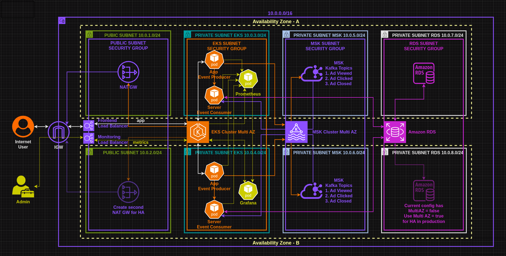
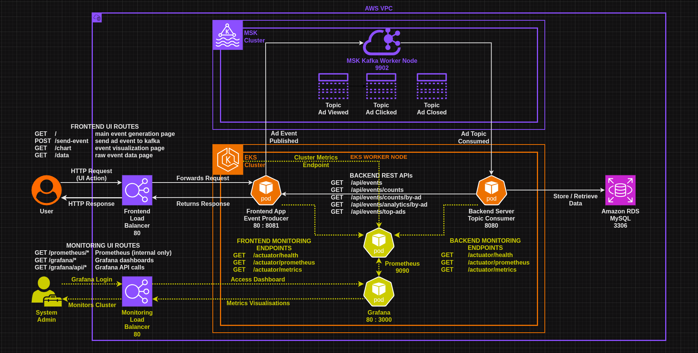
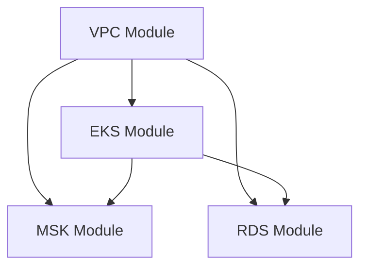
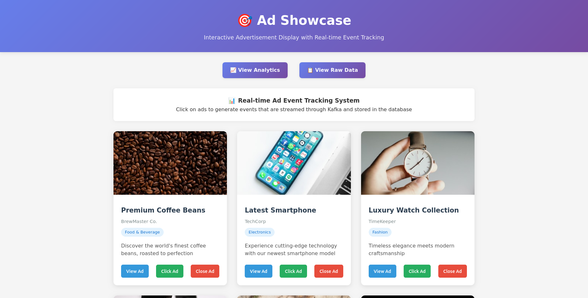
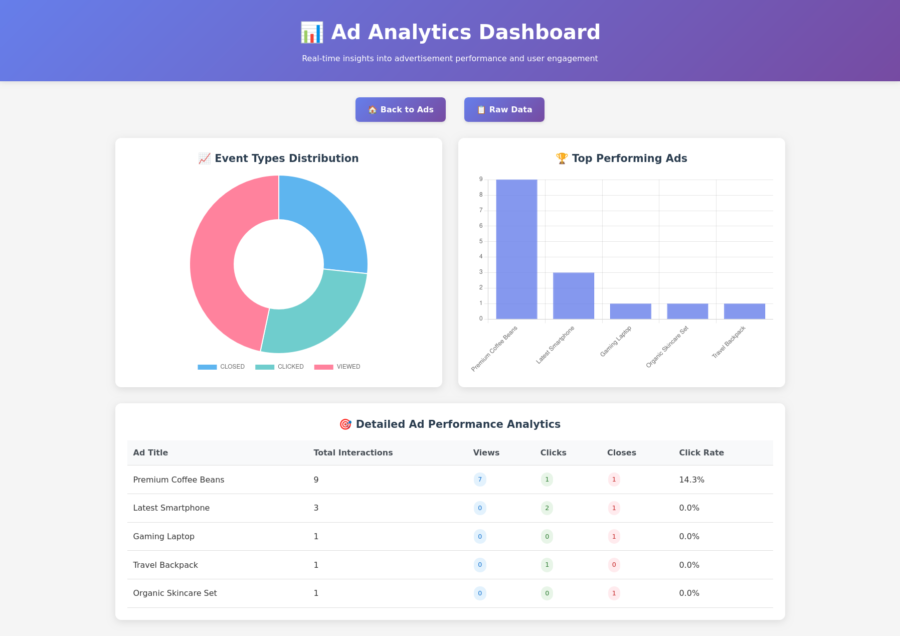
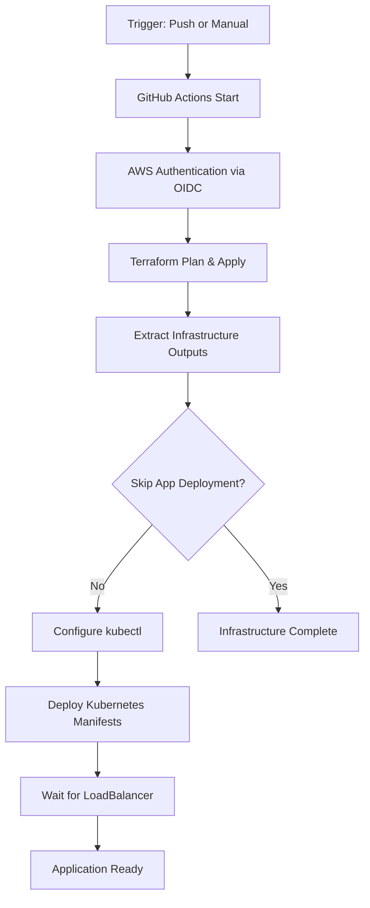

# EKS MSK RDS App - Cloud-Native Three-Tier Architecture

This project demonstrates a production-ready **three-tier Kubernetes application** deployed on AWS using **Amazon EKS**, **Amazon MSK (Managed Kafka)**, and **Amazon RDS**. It showcases modern cloud-native architecture patterns with event-driven communication, infrastructure as code, and automated CI/CD deployment.

**Application Source Code**: [react-springboot-kafka-apps](https://github.com/manvinderjit/react-springboot-kafka-apps)

---

## Architecture Overview


### Infrastructure Diagram


_Infrastructure Diagram showing the architecture deployed to AWS for the 3 Tier application._

### Network Architecture:

- **Public Subnets**: Classic Load Balancer (ELB) for external access
- **Private Subnets**: EKS worker nodes, MSK brokers
- **Database Subnets**: RDS instances (isolated)

The stack includes:

- **Frontend (Java ThymeLeaf)** - Event-driven template engine UI for real-time data visualization
- **Backend (Spring Boot)** - REST API with Kafka producer/consumer integration
- **Database (MySQL RDS)** - Persistent storage for application data
- **Message Queue (MSK)** - Event streaming between frontend and backend
- **Container Orchestration (EKS)** - Managed Kubernetes cluster

### Integration Diagram


_Integration Diagram showing how the tiers are integrated and communicate._

### Application Features:

- **Real-time Events**: Frontend publishes events via Kafka
- **Event Processing**: Backend consumes and processes Kafka messages
- **Data Persistence**: Events stored in MySQL database
- **Live Updates**: Real-time UI updates through event streaming

---

## Technology Stack

| Layer                       | Technology                  | Version/Config              | Purpose                             |
| --------------------------- | --------------------------- | --------------------------- | ----------------------------------- |
| **Infrastructure as Code**  | Terraform                   | >= 1.0, AWS Provider ~> 6.12 | Declarative infrastructure management |
| **Container Orchestration** | Amazon EKS                  | Kubernetes 1.33             | Managed Kubernetes cluster         |
| **Load Balancing**          | Classic Load Balancer (ELB) | Cross-zone enabled          | External traffic distribution       |
| **Message Streaming**       | Amazon MSK                  | Kafka 3.8.x                 | Event-driven communication          |
| **Database**                | Amazon RDS                  | MySQL 8.0.42                | Persistent data storage             |
| **Frontend Application**    | ThymeLeaf + Spring Boot     | Java-based                  | Server-side rendered web UI         |
| **Backend API**             | Spring Boot + Kafka         | REST + Event streaming      | Business logic & data processing    |
| **Container Images**        | Docker                      | manvinderjit/*:v3           | Application containerization        |
| **CI/CD Pipeline**          | GitHub Actions              | OIDC authentication         | Automated deployment & management   |
| **State Management**        | Terraform S3 Backend        | Encrypted, locked           | Infrastructure state persistence    |
| **Security**                | AWS IAM + Security Groups   | Least privilege             | Access control & network security   |

---

## Project Structure

```bash
eks-msk-rds-app/
│
├── images/                          # Architecture diagrams & screenshots
│   ├── 1-3-tier-eks-msk-rds-app-infra.png
│   ├── 2-ads-index.png
│   ├── 3-analytics-dash-full.png
│   ├── 3-tier-eks-msk-rds-app-traffic-flow.png
│   └── 4-raw-event-logs.png
│
├── modules/                         # Terraform modules
│   ├── vpc/                        # VPC with multi-tier networking
│   │   ├── main.tf                 # VPC, subnets, NAT gateway
│   │   ├── variables.tf            # VPC configuration variables
│   │   └── outputs.tf              # VPC resource outputs
│   ├── eks/                        # EKS cluster & node groups
│   │   ├── main.tf                 # EKS cluster, IAM roles, addons
│   │   ├── variables.tf            # EKS configuration variables
│   │   └── outputs.tf              # EKS resource outputs
│   ├── msk/                        # MSK Kafka cluster
│   │   ├── main.tf                 # MSK cluster, security groups
│   │   ├── variables.tf            # MSK configuration variables
│   │   └── outputs.tf              # MSK resource outputs
│   └── rds/                        # RDS MySQL database
│       ├── main.tf                 # RDS instance, subnet group
│       ├── variables.tf            # RDS configuration variables
│       └── outputs.tf              # RDS resource outputs
│
├── k8-manifests/                   # Kubernetes application manifests
│   ├── README.md                   # Deployment instructions
│   ├── backend/                    # Spring Boot backend service
│   │   ├── 1-deployment-backend.yaml      # Backend deployment
│   │   ├── 2-svc-cluster-backend.yaml     # Backend ClusterIP service
│   │   ├── configmap.yaml                 # Backend configuration
│   │   └── secrets.yaml                   # Backend database secrets
│   └── frontend/                   # ThymeLeaf frontend service
│       ├── 1-deployment-frontend.yaml     # Frontend deployment
│       ├── 2-2-svc-cluster-frontend.yaml  # Frontend ClusterIP service
│       ├── 3-svc-loadbalancer-frontend.yaml # Classic Load Balancer
│       └── configmap.yaml                 # Frontend configuration
│
├── main.tf                         # Root Terraform configuration
├── provider.tf                     # AWS provider & version constraints
├── backend.tf                      # S3 backend configuration
├── variables.tf                    # Input variables & sensitive data
├── outputs.tf                      # Infrastructure outputs
└── README.md                       # This documentation

# GitHub Actions Workflows (located in repository root)
.github/workflows/
├── eks-msk-rds-app.yaml           # Main deployment workflow
└── eks-msk-rds-app-destroy.yaml   # Infrastructure destruction workflow
```

---

## Infrastructure Components

### Amazon EKS Cluster
- **Kubernetes Version**: 1.33 (latest)
- **Node Group**: `eks-t3small-ng` with 2 t3.small instances
- **AMI Type**: AL2023_x86_64_STANDARD (Amazon Linux 2023)
- **Networking**: Private subnets with NAT gateway for internet access
- **Access Control**: API_AND_CONFIG_MAP authentication mode
- **Addons**: VPC CNI, CoreDNS, Kube Proxy
- **Security**: IAM roles with least privilege access
- **Scaling**: Fixed 2-node configuration (min=max=desired=2)

### Load Balancing & Networking
- **Type**: AWS Classic Load Balancer (ELB)
- **Configuration**: Cross-zone load balancing enabled
- **Health Checks**: HTTP on port 8081, path "/"
- **Timeouts**: 60s connection idle, 30s health check interval
- **Public Access**: Internet-facing load balancer in public subnets
- **Internal Communication**: ClusterIP services for inter-service communication

### Amazon MSK (Managed Kafka)
- **Kafka Version**: 3.8.x (latest)
- **Brokers**: 2 kafka.t3.small instances across AZs
- **Storage**: 10GB EBS per broker
- **Encryption**: PLAINTEXT (development configuration)
- **Network**: Dedicated private subnets with security group isolation
- **Access**: EKS nodes and cluster security groups allowed

### Amazon RDS Database
- **Engine**: MySQL 8.0.42
- **Instance Class**: db.t4g.micro (ARM-based Graviton2)
- **Storage**: 20GB GP2 SSD
- **Availability**: Single-AZ (cost-optimized)
- **Backup**: Disabled (skip_final_snapshot=true)
- **Network**: Isolated database subnets, no public access
- **Security**: Database security group allows MySQL (3306) from EKS

### VPC Network Architecture
- **CIDR Block**: `10.0.0.0/16` (65,536 IP addresses)
- **Availability Zones**: us-east-2a, us-east-2b
- **Public Subnets**: `10.0.1.0/24`, `10.0.2.0/24` (Load Balancer)
- **Private EKS Subnets**: `10.0.3.0/24`, `10.0.4.0/24` (Worker nodes)
- **Private MSK Subnets**: `10.0.5.0/24`, `10.0.6.0/24` (Kafka brokers)
- **Database Subnets**: `10.0.7.0/24`, `10.0.8.0/24` (RDS instances)
- **Internet Gateway**: Public subnet internet access
- **NAT Gateway**: Private subnet outbound internet access
- **Route Tables**: Separate routing for each subnet tier

---

## Terraform Module Architecture

This project uses a modular Terraform architecture for maintainability, reusability, and separation of concerns:

### Module Structure

**VPC Module** (`modules/vpc/`):
- Creates isolated network infrastructure with 8 subnets across 2 AZs
- Configures Internet Gateway, NAT Gateway, and route tables
- Implements proper subnet tagging for EKS integration
- Outputs subnet IDs for other modules

**EKS Module** (`modules/eks/`):
- Provisions managed Kubernetes cluster with worker nodes
- Configures IAM roles and policies for cluster and nodes
- Sets up EKS addons (VPC CNI, CoreDNS, Kube Proxy)
- Manages access entries for admin users and GitHub Actions
- Outputs cluster information and security group IDs

**MSK Module** (`modules/msk/`):
- Creates managed Kafka cluster with configurable brokers
- Sets up security groups for Kafka communication
- Configures encryption and networking settings
- Outputs bootstrap brokers and connection strings

**RDS Module** (`modules/rds/`):
- Provisions MySQL database with subnet groups
- Configures security groups for database access
- Sets up backup and maintenance windows
- Outputs database endpoints and connection details

### Module Dependencies



### Resource Tagging Strategy

All resources are tagged with:
- `ManagedBy: "GitAwsTerraformProjects"`
- `Project: "eks-msk-rds-app"`
- Additional resource-specific tags for organization

---

## Deployment Guide

### Prerequisites

1. **AWS CLI** configured with appropriate permissions
2. **kubectl** installed and configured
3. **Terraform** installed (v1.12.2+)
4. **GitHub Secrets** configured (see below)

### Step 1: Deploy Infrastructure

**Automated Deployment:**
The infrastructure is deployed automatically via GitHub Actions when you push to the `project/eks-msk-rds-app` branch.

**Manual Deployment via GitHub Actions:**
1. Go to **Actions** tab → **"Deploy a 3-tier EKS MSK RDS Infra and App"**
2. Click **"Run workflow"**
3. Select branch and deployment options:
   - **Infrastructure + Applications**: Leave "Skip application deployment" unchecked
   - **Infrastructure Only**: Check "Skip application deployment"
4. Click **"Run workflow"**

**Manual Deployment:**

```bash
cd eks-msk-rds-app

# Initialize Terraform with S3 backend
terraform init \
  -backend-config="bucket=YOUR_TFSTATE_BUCKET" \
  -backend-config="key=eks-msk-rds-app/terraform.tfstate" \
  -backend-config="region=YOUR_TFSTATE_REGION"

# Plan infrastructure changes
terraform plan \
  -var="eks_admin_user_arn=arn:aws:iam::ACCOUNT:user/USERNAME" \
  -var="db_name=YOUR_DB_NAME" \
  -var="db_username=YOUR_DB_USER" \
  -var="db_password=YOUR_DB_PASSWORD"

# Apply infrastructure
terraform apply
```

### Step 2: Configure kubectl

```bash
aws eks update-kubeconfig --region us-east-2 --name eks-msk-rds-app-cluster
```

### Step 3: Extract Infrastructure Outputs

Get the infrastructure outputs for application configuration:

```bash
# Get all Terraform outputs
terraform output

# Get specific values for manual configuration
export RDS_ENDPOINT=$(terraform output -raw db_instance_endpoint)
export MSK_BOOTSTRAP_BROKERS=$(terraform output -raw msk_bootstrap_brokers)
export RDS_PORT=$(terraform output -raw db_instance_port)

# Prepare environment variables for Kubernetes manifests
export DB_NAME="your-database-name"
export DB_USERNAME="your-db-username"
export DB_PASSWORD="your-db-password"
export DB_PASSWORD_BASE64=$(echo -n "$DB_PASSWORD" | base64 -w 0)
```

### Step 4: Deploy Applications

**With Environment Substitution (Recommended):**

```bash
# Deploy backend with environment variable substitution
envsubst < k8-manifests/backend/configmap.yaml | kubectl apply -f -
envsubst < k8-manifests/backend/secrets.yaml | kubectl apply -f -
kubectl apply -f k8-manifests/backend/1-deployment-backend.yaml
kubectl apply -f k8-manifests/backend/2-svc-cluster-backend.yaml

# Deploy frontend with environment variable substitution
envsubst < k8-manifests/frontend/configmap.yaml | kubectl apply -f -
kubectl apply -f k8-manifests/frontend/1-deployment-frontend.yaml
kubectl apply -f k8-manifests/frontend/2-2-svc-cluster-frontend.yaml
kubectl apply -f k8-manifests/frontend/3-svc-loadbalancer-frontend.yaml

# Check deployment status
kubectl get pods -o wide
kubectl get services
kubectl get deployments
```

**Direct Deployment (requires manual ConfigMap editing):**

```bash
# Deploy all manifests (requires pre-configured ConfigMaps)
kubectl apply -f k8-manifests/backend/
kubectl apply -f k8-manifests/frontend/
```

### Step 5: Access Application

```bash
# Get Classic Load Balancer URL
kubectl get service service-kafka-project-frontend-lb -o jsonpath='{.status.loadBalancer.ingress[0].hostname}'

# Wait for LoadBalancer to be ready (may take 2-3 minutes)
kubectl get service service-kafka-project-frontend-lb --watch

# Check application health
kubectl get pods -l app=kafka-project-frontend
kubectl get pods -l app=kafka-project-backend

# View application logs
kubectl logs -l app=kafka-project-frontend --tail=50
kubectl logs -l app=kafka-project-backend --tail=50
```

**Application Access Points:**
- **Frontend Web UI**: `http://<ELB-HOSTNAME>` (port 80)
- **Backend API**: `http://service-kafka-project-backend:8080/api/events` (internal only)
- **Health Checks**: 
  - Frontend: `http://<ELB-HOSTNAME>/` 
  - Backend: `http://service-kafka-project-backend:8080/api/events`

### Application Usage

Once deployed, the application provides:

1. **Event Creation**: Use the ThymeLeaf Java frontend to create and publish events
2. **Real-time Processing**: Events are processed through Kafka and stored in MySQL
3. **Live Updates**: Frontend displays real-time updates as events are processed
4. **API Access**: Backend exposes REST endpoints for event management

**Source Code Repository**: [react-springboot-kafka-apps](https://github.com/manvinderjit/react-springboot-kafka-apps)

## Application Screenshots

### Main Application Interface


_Main application interface for event management and real-time data visualization_

### Analytics Dashboard


_Real-time analytics dashboard showing event processing and data insights_

### Event Logs


_Raw event logs displaying Kafka message processing and database interactions_

---

## Required Configuration

### GitHub Secrets (Repository Settings)

Configure these secrets in your GitHub repository settings (**Settings** → **Secrets and variables** → **Actions**):

| Secret Name                       | Description                       | Used In                          | Example Value                    |
| --------------------------------- | --------------------------------- | -------------------------------- | -------------------------------- |
| `AWS_REGION`                      | AWS deployment region            | Both workflows (env var)        | `us-east-2`                      |
| `AWS_TERRAFORM_GITHUB_ROLE`       | IAM Role ARN for GitHub OIDC     | Both workflows (authentication) | `arn:aws:iam::123456789012:role/GitHubActionsRole` |
| `AWS_TFSTATE_BUCKET_NAME`         | S3 bucket for Terraform state    | Both workflows (backend config) | `my-terraform-state-bucket`      |
| `AWS_TFSTATE_BUCKET_KEY_NAME`     | State file key path              | Both workflows (backend config) | `terraform.tfstate`              |
| `AWS_TFSTATE_REGION`              | Region for state bucket          | Both workflows (backend config) | `us-east-2`                      |
| `EKS_ADMIN_USER_ARN`              | IAM User ARN for EKS admin       | Both workflows (Terraform var)  | `arn:aws:iam::123456789012:user/eks-admin` |
| `AWS_THREE_TIER_RDS_DB_NAME`      | RDS database name                | Both workflows (Terraform var)  | `kafkaprojectdb`                 |
| `AWS_THREE_TIER_RDS_DB_USER_NAME` | RDS master username              | Both workflows (Terraform var)  | `admin`                          |
| `AWS_THREE_TIER_RDS_DB_PASSWORD`  | RDS master password              | Both workflows (Terraform var)  | `SecurePassword123!`             |

### Secret Usage in Workflows

**Environment Variables** (used in both workflows):
- `AWS_REGION` and `AWS_TFSTATE_REGION`: Set as workflow environment variables
- Used for AWS CLI configuration and Terraform backend

**Authentication** (used in both workflows):
- `AWS_TERRAFORM_GITHUB_ROLE`: OIDC role assumption for AWS access
- Eliminates need for long-lived AWS access keys

**Terraform Backend Configuration** (used in both workflows):
- `AWS_TFSTATE_BUCKET_NAME`, `AWS_TFSTATE_BUCKET_KEY_NAME`, `AWS_TFSTATE_REGION`
- Configure S3 backend for state storage during `terraform init`

**Terraform Variables** (used in both workflows):
- `EKS_ADMIN_USER_ARN`: Grants EKS cluster admin access
- `AWS_THREE_TIER_RDS_DB_*`: Database configuration and credentials

**Application Configuration** (deploy workflow only):
- Database secrets are Base64 encoded and injected into Kubernetes secrets
- Used for runtime application configuration via environment variables

### Terraform Variables

The following variables are defined in `variables.tf` and populated from GitHub secrets:

```hcl
variable "aws_region" {
  description = "AWS region for resource deployment"
  type        = string
  default     = "us-east-2"
}

variable "eks_admin_user_arn" {
  description = "IAM user ARN for EKS cluster admin access"
  type        = string
}

variable "github_actions_role_arn" {
  description = "GitHub Actions IAM role ARN for CI/CD"
  type        = string
  default     = ""
}

variable "db_username" {
  description = "RDS database master username"
  type        = string
  sensitive   = true
}

variable "db_password" {
  description = "RDS database master password"
  type        = string
  sensitive   = true
}

variable "db_name" {
  description = "RDS default database name"
  type        = string
  sensitive   = true
}
```

### Setting Up GitHub Secrets

**Step 1: Navigate to Repository Settings**
1. Go to your GitHub repository
2. Click **Settings** tab
3. In the left sidebar, click **Secrets and variables** → **Actions**

**Step 2: Add Repository Secrets**
1. Click **New repository secret**
2. Enter the secret name (exactly as shown in table above)
3. Enter the secret value
4. Click **Add secret**
5. Repeat for all required secrets

**Step 3: Verify Secret Configuration**
- All secrets should be visible in the **Repository secrets** section
- Secret values are hidden after creation (this is normal)
- You can update secret values by clicking the **Update** button

**Important Notes**:
- Secret names are case-sensitive and must match exactly
- Database password should be strong and meet AWS RDS requirements
- IAM role ARN must have appropriate permissions for EKS, MSK, RDS, and VPC operations
- S3 bucket for Terraform state must exist and be accessible by the IAM role

---

## Application Configuration

### Backend Service Configuration

**ConfigMap** (`k8-manifests/backend/configmap.yaml`):
```yaml
apiVersion: v1
kind: ConfigMap
metadata:
  name: backend-config
data:
  SPRING_KAFKA_BOOTSTRAP_SERVERS: "${MSK_BOOTSTRAP_BROKERS}"
  SPRING_DATASOURCE_URL: "jdbc:mysql://${RDS_ENDPOINT}:${RDS_PORT}/${DB_NAME}?createDatabaseIfNotExist=true"
  SPRING_DATASOURCE_USERNAME: "${DB_USERNAME}"
```

**Secrets** (`k8-manifests/backend/secrets.yaml`):
```yaml
apiVersion: v1
kind: Secret
metadata:
  name: backend-secrets
type: Opaque
data:
  SPRING_DATASOURCE_PASSWORD: ${DB_PASSWORD_BASE64}  # Base64 encoded
```

**Deployment Configuration**:
- **Image**: `manvinderjit/kafka-project-backend:v3`
- **Replicas**: 2 (high availability)
- **Resources**: 250m CPU / 256Mi RAM (requests), 500m CPU / 512Mi RAM (limits)
- **Health Checks**: Readiness/Liveness probes on `/api/events`
- **Port**: 8080 (internal service communication)

### Frontend Service Configuration

**ConfigMap** (`k8-manifests/frontend/configmap.yaml`):
```yaml
apiVersion: v1
kind: ConfigMap
metadata:
  name: frontend-config
data:
  SPRING_KAFKA_BOOTSTRAP_SERVERS: "${MSK_BOOTSTRAP_BROKERS}"
  SPRING_APPLICATION_NAME: "frontend"
  BACKEND_API_URL: "http://service-kafka-project-backend:8080/api/events"
```

**Deployment Configuration**:
- **Image**: `manvinderjit/kafka-project-frontend:v3`
- **Replicas**: 2 (high availability)
- **Resources**: 250m CPU / 256Mi RAM (requests), 500m CPU / 512Mi RAM (limits)
- **Health Checks**: Readiness/Liveness probes on `/`
- **Port**: 8081 (web interface)

### Service Architecture

**Backend Services**:
- `service-kafka-project-backend` (ClusterIP): Internal API communication
- Port 8080 → Backend pods

**Frontend Services**:
- `service-kafka-project-frontend` (ClusterIP): Internal frontend service
- `service-kafka-project-frontend-lb` (LoadBalancer): External access via Classic ELB
- Port 80 (external) → Port 8081 (pods)

### Environment Variable Substitution

The CI/CD pipeline uses `envsubst` to replace variables in manifests:
- `${MSK_BOOTSTRAP_BROKERS}` → Terraform output from MSK cluster
- `${RDS_ENDPOINT}` → Terraform output from RDS instance
- `${RDS_PORT}` → Database port (3306)
- `${DB_NAME}`, `${DB_USERNAME}` → GitHub secrets
- `${DB_PASSWORD_BASE64}` → Base64 encoded password from GitHub secrets

---

## Health Checks & Monitoring

### Application Health

```bash
# Check pod status
kubectl get pods

# View logs
kubectl logs -l app=kafka-project-backend
kubectl logs -l app=kafka-project-frontend

# Check service endpoints
kubectl get endpoints
```

### Infrastructure Health

```bash
# EKS cluster status
aws eks describe-cluster --name eks-msk-rds-app-cluster

# MSK cluster status
aws kafka list-clusters

# RDS status
aws rds describe-db-instances --db-instance-identifier terraform-db
```

---

## CI/CD Pipeline Architecture

### GitHub Actions Workflows

The project includes two main workflows for complete lifecycle management:

#### 1. Deployment Workflow (`eks-msk-rds-app.yaml`)

**Infrastructure Deployment**:
1. **Authentication**: OIDC-based AWS authentication using GitHub Actions role
2. **Terraform Validation**: Format check, init, validate, and plan
3. **Terraform Apply**: Deploy/update AWS infrastructure
4. **Output Extraction**: Capture RDS endpoints, MSK brokers, EKS cluster info

**Application Deployment**:
5. **EKS Authentication**: Configure kubectl with cluster credentials
6. **Environment Substitution**: Replace variables in Kubernetes manifests using `envsubst`
7. **Kubernetes Deployment**: Apply ConfigMaps, Secrets, Deployments, and Services
8. **Health Verification**: Wait for deployments and LoadBalancer readiness
9. **Access Information**: Output LoadBalancer URL for application access

**Trigger Mechanisms**:
- **Automatic**: Push to `project/eks-msk-rds-app` branch (deploys both infrastructure and applications)
- **Manual**: Workflow dispatch with optional parameters:
  - `skip_app_deployment`: Deploy infrastructure only (skip Kubernetes applications)

**Manual Trigger Usage**:
1. Navigate to **Actions** tab in GitHub repository
2. Select **"Deploy a 3-tier EKS MSK RDS Infra and App"** workflow
3. Click **"Run workflow"**
4. Choose options:
   - **Branch**: Select branch to deploy from
   - **Skip application deployment**: Check to deploy infrastructure only
5. Click **"Run workflow"** to start deployment

#### 2. Destroy Workflow (`eks-msk-rds-app-destroy.yaml`)

**Safety Features**:
- **Confirmation Required**: Must type "DESTROY" exactly to proceed
- **Pre-Destroy Cleanup**: Removes LoadBalancer services to prevent orphaned ELBs
- **Post-Destroy Cleanup**: Checks for and removes any remaining load balancers

**Destruction Process**:
1. **Authentication**: Same OIDC-based AWS authentication
2. **kubectl Configuration**: Attempts to configure kubectl for cleanup
3. **LoadBalancer Cleanup**: Removes Kubernetes LoadBalancer services first
4. **Terraform Plan Destroy**: Generates destruction plan
5. **Terraform Destroy**: Destroys all infrastructure resources
6. **Post-Cleanup**: Removes any orphaned AWS load balancers
7. **Verification**: Confirms successful destruction

**Trigger Mechanism**:
- **Manual Only**: Workflow dispatch with confirmation input

**Usage**:
```bash
# Via GitHub Actions UI:
# 1. Go to Actions tab
# 2. Select "Destroy EKS MSK RDS App Infrastructure"
# 3. Click "Run workflow"
# 4. Type "DESTROY" in the confirmation field
# 5. Click "Run workflow"
```

### Security & Best Practices

**Authentication & Authorization**:
- GitHub OIDC provider integration (no long-lived AWS keys)
- IAM roles with least privilege access
- EKS cluster access via IAM roles and access entries
- Workflow permissions limited to `id-token: write` and `contents: read`

**State Management**:
- Terraform state stored in encrypted S3 bucket
- State locking with DynamoDB (if configured)
- Backend configuration externalized via GitHub secrets

**Secrets Management**:
- Sensitive values stored as GitHub repository secrets
- Database passwords Base64 encoded in Kubernetes secrets
- No hardcoded credentials in code or manifests
- Environment variables used for runtime configuration

**Workflow Safety**:
- **Destroy Protection**: Requires exact "DESTROY" confirmation
- **Cleanup Automation**: Prevents orphaned AWS resources
- **Error Handling**: `continue-on-error` for cleanup steps
- **Resource Verification**: Post-operation status checks

### Deployment Scenarios

**Full Deployment (Default)**:
- Infrastructure provisioning (EKS, MSK, RDS, VPC)
- Application deployment (Frontend + Backend)
- LoadBalancer configuration and health checks

**Infrastructure-Only Deployment**:
- Use manual trigger with `skip_app_deployment: true`
- Provisions AWS infrastructure without Kubernetes applications
- Useful for infrastructure testing or staged deployments

### Deployment Workflow



---

## Troubleshooting Guide

### Common Issues & Solutions

**EKS Cluster Access Issues:**
```bash
# Update kubeconfig if access denied
aws eks update-kubeconfig --region us-east-2 --name eks-msk-rds-app-cluster

# Check EKS cluster status
aws eks describe-cluster --name eks-msk-rds-app-cluster --query 'cluster.status'

# Verify IAM permissions
aws sts get-caller-identity
```

**Pod Startup Issues:**
```bash
# Check pod status and events
kubectl describe pod <pod-name>
kubectl get events --sort-by=.metadata.creationTimestamp

# Check resource constraints
kubectl top nodes
kubectl top pods

# View detailed logs
kubectl logs <pod-name> --previous  # Previous container logs
kubectl logs <pod-name> -c <container-name>  # Specific container
```

**Database Connection Issues:**
```bash
# Test RDS connectivity from EKS
kubectl run mysql-client --image=mysql:8.0 --rm -it --restart=Never -- \
  mysql -h <RDS_ENDPOINT> -u <USERNAME> -p<PASSWORD> -e "SELECT 1"

# Check security group rules
aws ec2 describe-security-groups --group-ids <RDS_SECURITY_GROUP_ID>
```

**Kafka Connection Issues:**
```bash
# Test MSK connectivity
kubectl run kafka-client --image=confluentinc/cp-kafka:latest --rm -it --restart=Never -- \
  kafka-topics --bootstrap-server <MSK_BOOTSTRAP_BROKERS> --list

# Check MSK cluster status
aws kafka describe-cluster --cluster-arn <MSK_CLUSTER_ARN>
```

**LoadBalancer Issues:**
```bash
# Check LoadBalancer status
kubectl describe service service-kafka-project-frontend-lb

# View LoadBalancer events
kubectl get events --field-selector involvedObject.name=service-kafka-project-frontend-lb

# Check ELB in AWS Console or CLI
aws elbv2 describe-load-balancers --names <ELB_NAME>
```

### Debugging Commands

**Infrastructure Status:**
```bash
# Terraform state inspection
terraform show
terraform state list
terraform output

# AWS resource verification
aws eks list-clusters
aws kafka list-clusters
aws rds describe-db-instances
```

**Application Status:**
```bash
# Comprehensive status check
kubectl get all -o wide
kubectl get configmaps
kubectl get secrets
kubectl get ingress

# Resource usage
kubectl describe nodes
kubectl get pods -o jsonpath='{range .items[*]}{.metadata.name}{"\t"}{.status.phase}{"\n"}{end}'
```

---

## Cleanup

### Complete Cleanup Process

**Step 1: Remove Kubernetes Applications**
```bash
# Remove applications first to clean up LoadBalancer
kubectl delete -f k8-manifests/frontend/
kubectl delete -f k8-manifests/backend/

# Verify LoadBalancer is deleted (important for cost)
kubectl get services
aws elbv2 describe-load-balancers --query 'LoadBalancers[?contains(LoadBalancerName, `kafka-project`)]'
```

**Step 2: Destroy Infrastructure**

**Via GitHub Actions (Recommended):**
1. Navigate to the **Actions** tab in your GitHub repository
2. Select **"Destroy EKS MSK RDS App Infrastructure"** workflow
3. Click **"Run workflow"**
4. Type **"DESTROY"** exactly in the confirmation field
5. Click **"Run workflow"** to start the destruction process

This automated approach ensures:
- Proper cleanup order (Kubernetes resources first, then infrastructure)
- LoadBalancer cleanup to prevent orphaned ELBs
- Post-destroy verification and cleanup of any remaining resources

**Manual Destruction:**
```bash
# Ensure all Kubernetes resources are deleted first
kubectl get all

# Destroy Terraform infrastructure
terraform destroy \
  -var="eks_admin_user_arn=arn:aws:iam::ACCOUNT:user/USERNAME" \
  -var="db_name=YOUR_DB_NAME" \
  -var="db_username=YOUR_DB_USER" \
  -var="db_password=YOUR_DB_PASSWORD"

# Verify cleanup
aws eks list-clusters --query 'clusters[?contains(name, `eks-msk-rds-app`)]'
aws kafka list-clusters --query 'ClusterInfoList[?contains(ClusterName, `eks-msk-rds-app`)]'
aws rds describe-db-instances --query 'DBInstances[?contains(DBInstanceIdentifier, `terraform-db`)]'
```

**Step 3: Clean Up State (if needed)**
```bash
# Remove Terraform state file (only if completely done)
aws s3 rm s3://YOUR_TFSTATE_BUCKET/eks-msk-rds-app/terraform.tfstate

# Remove state lock (if using DynamoDB locking)
aws dynamodb delete-item --table-name terraform-locks --key '{"LockID":{"S":"YOUR_LOCK_ID"}}'
```

### Cost Optimization Notes

**High-Cost Resources to Monitor:**
- NAT Gateway (~$45/month)
- EKS Cluster (~$73/month)
- RDS Instance (~$13/month for db.t4g.micro)
- MSK Cluster (~$90/month for 2 kafka.t3.small brokers)
- Classic Load Balancer (~$18/month)

**Total Estimated Monthly Cost: ~$240**

Always ensure complete cleanup to avoid unexpected charges!

---

## Key Features & Capabilities

### Infrastructure Excellence
- **Infrastructure as Code**: Complete Terraform automation with modular architecture
- **Multi-Tier Networking**: Isolated subnets for web, app, data, and messaging tiers
- **High Availability**: Multi-AZ deployment across us-east-2a and us-east-2b
- **Cost Optimized**: Right-sized instances (t3.small, db.t4g.micro, kafka.t3.small)
- **Security First**: Network isolation, security groups, IAM least privilege

### Application Architecture
- **Cloud-Native**: Kubernetes-native deployment with container orchestration
- **Event-Driven**: Real-time Kafka messaging between frontend and backend
- **Microservices**: Decoupled frontend and backend services
- **Load Balancing**: Classic ELB with cross-zone load balancing
- **Health Monitoring**: Comprehensive readiness and liveness probes

### Operational Excellence
-  **GitOps Workflow**: Automated CI/CD with GitHub Actions
-  **Configuration Management**: Externalized config via ConfigMaps and Secrets
-  **State Management**: Terraform S3 backend with encryption
-  **Resource Management**: CPU/memory requests and limits defined
-  **Topology Awareness**: Pod anti-affinity for optimal distribution

###  Security & Compliance
-  **Network Security**: Private subnets, security groups, no public database access
-  **Identity Management**: IAM roles, EKS access entries, OIDC authentication
-  **Secrets Management**: Kubernetes secrets with Base64 encoding
- **Encryption**: S3 state encryption, secure communication channels
-  **Access Control**: Principle of least privilege throughout

###  Monitoring & Observability
-  **Health Checks**: Application-level health endpoints
- **Resource Monitoring**: Kubernetes resource requests/limits
-  **Infrastructure Outputs**: Comprehensive Terraform outputs for debugging
-  **Service Discovery**: Kubernetes DNS for inter-service communication
-  **Load Balancer Metrics**: ELB health check monitoring

---

##  Additional Resources

- **Application Source**: [react-springboot-kafka-apps](https://github.com/manvinderjit/react-springboot-kafka-apps)
- [Amazon EKS Documentation](https://docs.aws.amazon.com/eks/)
- [Amazon MSK Documentation](https://docs.aws.amazon.com/msk/)
- [Kubernetes Documentation](https://kubernetes.io/docs/)
- [Spring Boot Kafka Integration](https://spring.io/projects/spring-kafka)

---

## License

**MIT License** – Use this project for learning, testing, or as a foundation for your own applications.
